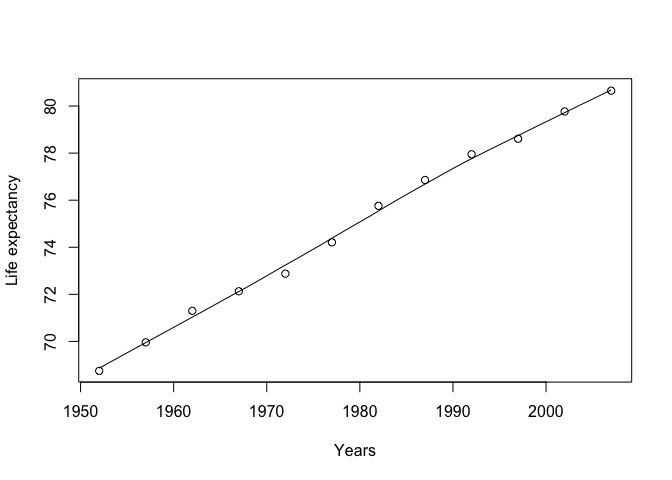
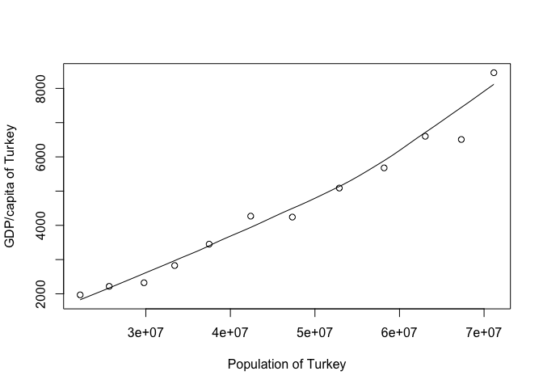

Data Frame Exploration
================
Emre Erhan
September 17, 2018

## Exploring `gapminder`

### Setting up

We load `gapminder` using the `library` function

``` r
library(gapminder)
```

### Exploring gapminder

The `head` command gives us the first part of the gapminder dataset, so
we can see what it looks like.

``` r
head(gapminder)
```

    ## # A tibble: 6 x 6
    ##   country     continent  year lifeExp      pop gdpPercap
    ##   <fct>       <fct>     <int>   <dbl>    <int>     <dbl>
    ## 1 Afghanistan Asia       1952    28.8  8425333      779.
    ## 2 Afghanistan Asia       1957    30.3  9240934      821.
    ## 3 Afghanistan Asia       1962    32.0 10267083      853.
    ## 4 Afghanistan Asia       1967    34.0 11537966      836.
    ## 5 Afghanistan Asia       1972    36.1 13079460      740.
    ## 6 Afghanistan Asia       1977    38.4 14880372      786.

We can get a good summary of `gapminder` using the summary function:

``` r
summary(gapminder)
```

    ##         country        continent        year         lifeExp     
    ##  Afghanistan:  12   Africa  :624   Min.   :1952   Min.   :23.60  
    ##  Albania    :  12   Americas:300   1st Qu.:1966   1st Qu.:48.20  
    ##  Algeria    :  12   Asia    :396   Median :1980   Median :60.71  
    ##  Angola     :  12   Europe  :360   Mean   :1980   Mean   :59.47  
    ##  Argentina  :  12   Oceania : 24   3rd Qu.:1993   3rd Qu.:70.85  
    ##  Australia  :  12                  Max.   :2007   Max.   :82.60  
    ##  (Other)    :1632                                                
    ##       pop              gdpPercap       
    ##  Min.   :6.001e+04   Min.   :   241.2  
    ##  1st Qu.:2.794e+06   1st Qu.:  1202.1  
    ##  Median :7.024e+06   Median :  3531.8  
    ##  Mean   :2.960e+07   Mean   :  7215.3  
    ##  3rd Qu.:1.959e+07   3rd Qu.:  9325.5  
    ##  Max.   :1.319e+09   Max.   :113523.1  
    ## 

### Let’s look at population sizes

Let’s look at some descriptive statistics for the `pop` column.

``` r
median(gapminder$pop)
```

    ## [1] 7023596

``` r
mean(gapminder$pop)
```

    ## [1] 29601212

``` r
sd(gapminder$pop)
```

    ## [1] 106157897

``` r
var(gapminder$pop)
```

    ## [1] 1.12695e+16

We can see that these statistics agree with the statistics we got from
the summary command above.

### An `if` statement

Let’s see if the mean life expectancy is greater than that of Canada’s,
82.

``` r
if (mean(gapminder$lifeExp) > 82){
  print('It is!')
}else{
  print('It\'s not!')
}
```

    ## [1] "It's not!"

### Let’s see how Canadian life expectancy has changed over the years

``` r
canada_index = gapminder$country=="Canada"
x = gapminder$year[canada_index]
y = gapminder$lifeExp[canada_index]
scatter.smooth(x, y, xlab="Years", ylab="Life expectancy")
```

<!-- -->

### Is there a relationship between the `gdpPercap` and `pop` of Turkey over the years the data was taken?

``` r
turkey_index = gapminder$country=="Turkey"
x = gapminder$pop[turkey_index]
y = gapminder$gdpPercap[turkey_index]
scatter.smooth(x, y, xlab="Population of Turkey", ylab="GDP/capita of Turkey")
```

<!-- -->

There does appear to be a relationship\! We can confirm this by getting
the correlation.

``` r
cor(x, y)
```

    ## [1] 0.9809777

However, remember that a correlation does not suggest that either of
these variables impact each other directly. We cannot say anything
causal.
